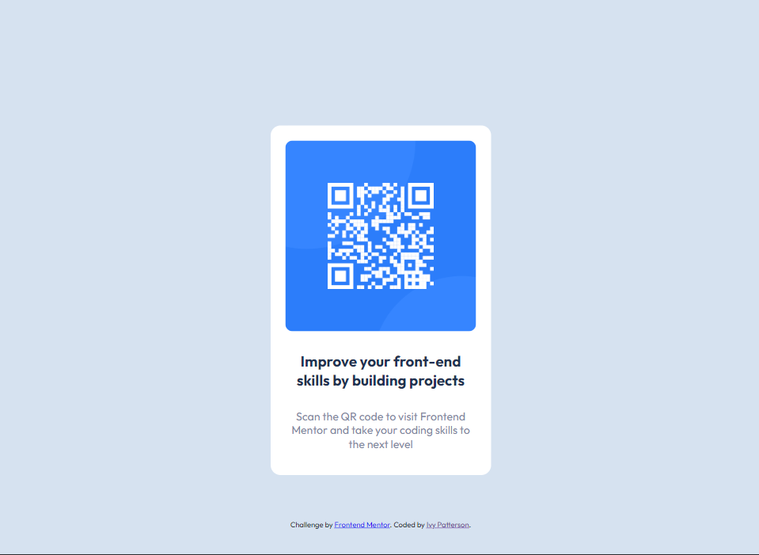

# Frontend Mentor - QR code component solution

This is a solution to the [QR code component challenge on Frontend Mentor](https://www.frontendmentor.io/challenges/qr-code-component-iux_sIO_H). Frontend Mentor challenges help you improve your coding skills by building realistic projects. 

## Table of contents

- [Overview](#overview)
  - [Screenshot](#screenshot)
  - [Links](#links)
- [My process](#my-process)
  - [Built with](#built-with)
  - [Continued development](#continued-development)
- [Author](#author)

## Overview
My first Front-end Mentor project. The goal was to recreate the design files provided, displaying a QR code linking to the Front-End Mentor site. I created a mobile version and a desktop version with the specified sizes.

### Screenshot

### Links

- Solution URL: [https://www.frontendmentor.io/solutions/mobilefirst-design-with-flexbox-RAko-AnbP9](https://www.frontendmentor.io/solutions/mobilefirst-design-with-flexbox-RAko-AnbP9)
- Live Site URL: [https://ivy-p.github.io/qr-code-challenge/](https://ivy-p.github.io/qr-code-challenge/)

## My process
I designed this mobile-first in CSS, which made changes to the desktop version fairly simple. I opted to use Flexbox as it's what I'm most familiar with.

### Built with

- Semantic HTML5 markup
- CSS custom properties
- Flexbox
- Mobile-first workflows

### Continued development

I would like to circle back and do this project with CSS Grid in the future; I want more practice with it.

## Author

- Website - [Ivy Patterson](https://www.ivypatterson.com)
- Frontend Mentor - [@ivy-p](https://www.frontendmentor.io/profile/ivy-p)
- Twitter - [@ivy_html](https://www.twitter.com/ivy_html)

